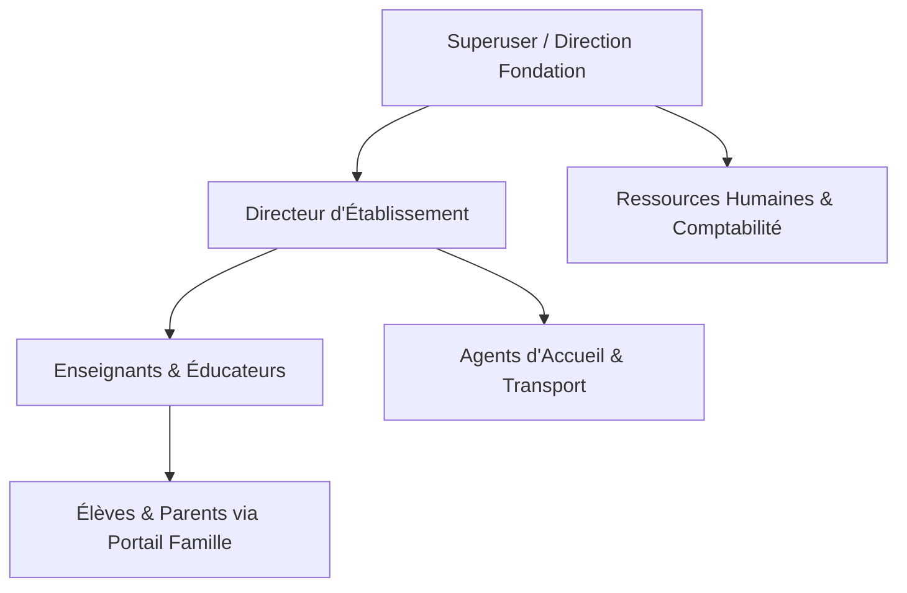
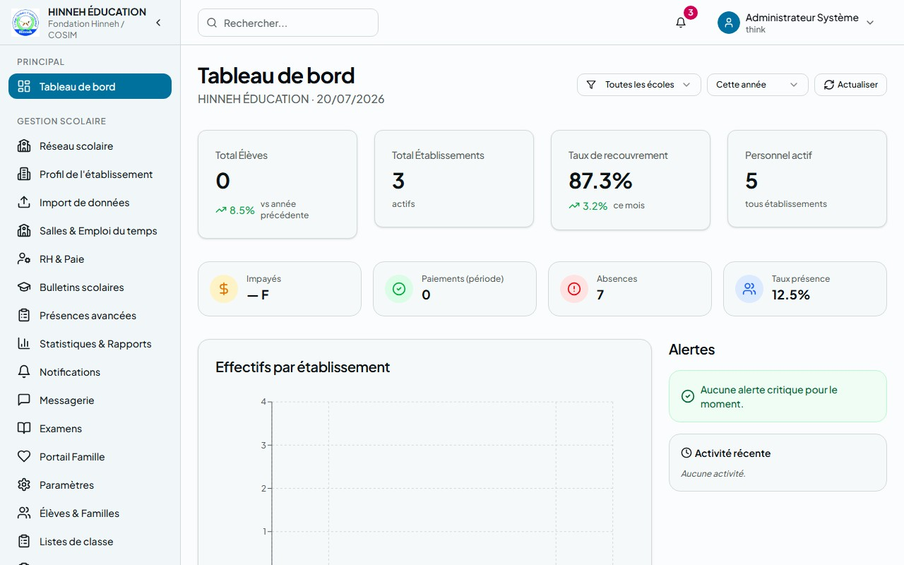
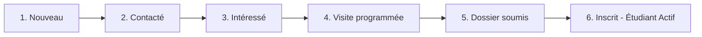
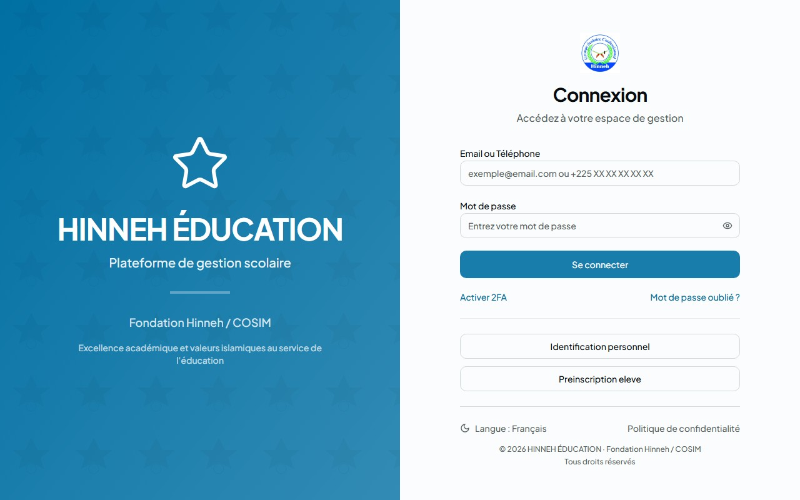
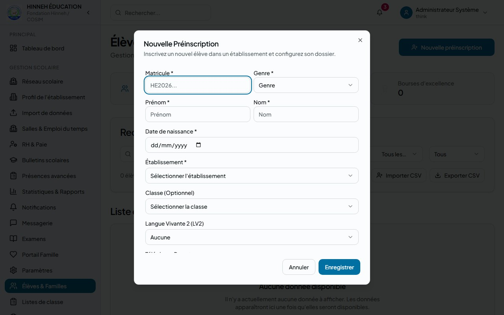
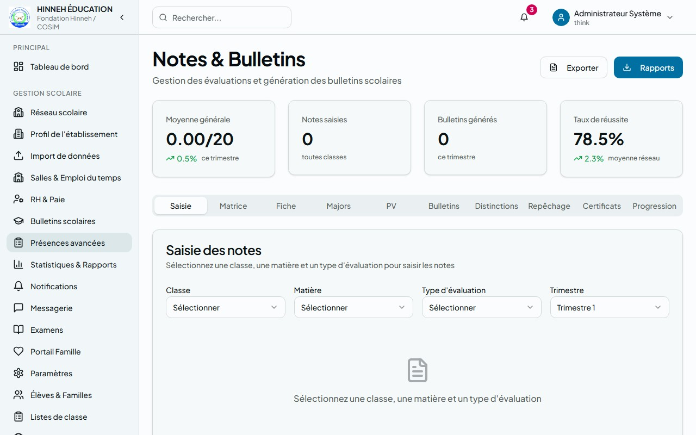
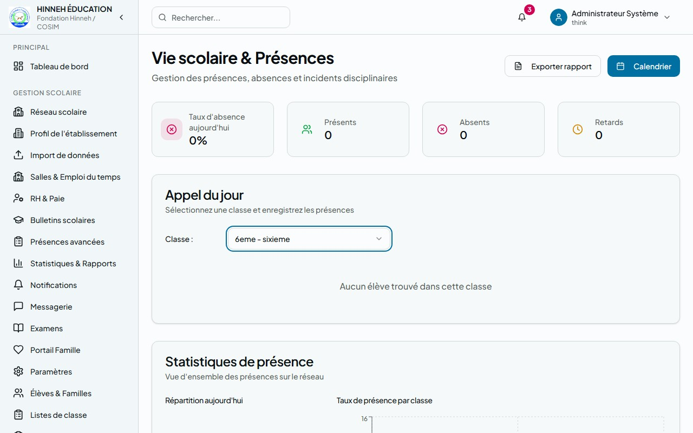
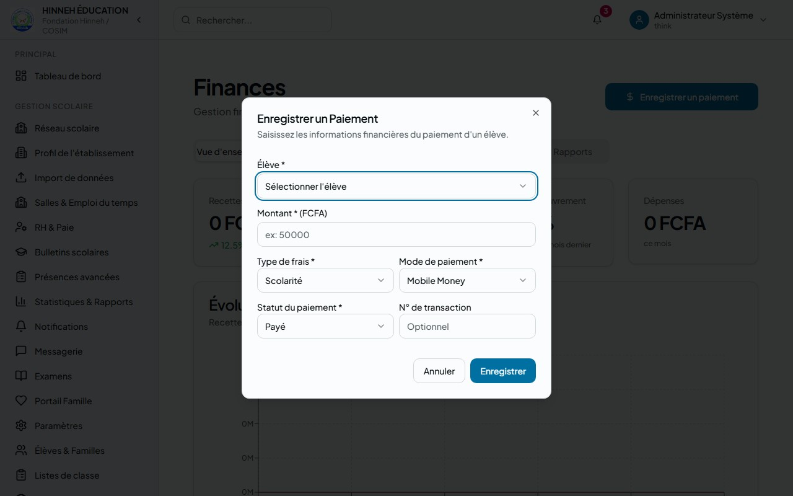

# Guide d'Utilisation Complet : HINNEH ÉDUCATION
*Système de Gestion Scolaire Multi-Établissements (ERP)*

> [!NOTE]
> Ce guide est destiné à tous les acteurs du réseau **HINNEH ÉDUCATION** : administrateurs, directeurs d'établissements, enseignants, éducateurs, comptables, personnel RH et parents.

---

## Sommaire
1. [Vue d'Ensemble & Architecture des Rôles](#1-vue-densemble--architecture-des-rôles)
2. [Module 1 : Tableau de Bord & Indicateurs Clés (KPI)](#2-module-1--tableau-de-bord--indicateurs-clés-kpi)
3. [Module 2 : CRM & Gestion de la Relation Familles](#3-module-2--crm--gestion-de-la-relation-familles)
4. [Module 3 : Scolarité, Vie Scolaire & Suivi Confessionnel (Coran)](#4-module-3--scolarité-vie-scolaire--suivi-confessionnel-coran)
5. [Module 4 : Gestion des Notes, Bulletins & Examens](#5-module-4--gestion-des-notes-bulletins--examens)
6. [Module 5 : Gestion Administrative & Ressources Humaines (RH)](#6-module-5--gestion-administrative--ressources-humaines-rh)
7. [Module 6 : Gestion Financière, Tarifs & Réductions](#7-module-6--gestion-financière-tarifs--réductions)
8. [Module 7 : Importation de Données en Masse (Excel/CSV)](#8-module-7--importation-de-données-en-masse-excelcsv)
9. [Module 8 : Services Auxiliaires (Transports & Salles)](#9-module-8--services-auxiliaires-transports--salles)
10. [Procédures de Saisie de Données Pas-à-Pas (Tutoriels)](#10-procédures-de-saisie-de-données-pas-à-pas-tutoriels)

---

## 1. Vue d'Ensemble & Architecture des Rôles

Le système **HINNEH ÉDUCATION** est une plateforme multi-établissements conçue pour unifier la gestion administrative, pédagogique, confessionnelle et financière. L'accès aux fonctionnalités est strictement contrôlé selon les rôles utilisateurs.

### Tableau de Matrice des Droits d'Accès

| Rôle | Dashboard | CRM | Scolarité | Notes & Bulletins | Finances | RH & Pointages | Configuration |
| :--- | :---: | :---: | :---: | :---: | :---: | :---: | :---: |
| **Superuser / Admin** | 👑 Tout | 👑 Tout | 👑 Tout | 👑 Tout | 👑 Tout | 👑 Tout | 👑 Tout |
| **Direction Fondation**| ✅ Lecture | ✅ Tout | ✅ Lecture | ✅ Lecture | ✅ Lecture | ✅ Lecture | ❌ Non |
| **Directeur École** | ✅ Son école| ❌ Non | ✅ Tout | ✅ Tout | ✅ Son école| ✅ Son école| ❌ Non |
| **Enseignant** | ❌ Non | ❌ Non | ✅ Classes | ✅ Saisie notes| ❌ Non | ❌ Non | ❌ Non |
| **Éducateur** | ❌ Non | ❌ Non | ✅ Absences | ✅ Lecture | ❌ Non | ✅ Pointages | ❌ Non |
| **Comptable** | ✅ Partiel | ❌ Non | ✅ Partiel | ❌ Non | ✅ Tout | ❌ Non | ❌ Non |
| **RH** | ❌ Non | ❌ Non | ❌ Non | ❌ Non | ❌ Non | ✅ Tout | ❌ Non |
| **Parent / Élève** | ❌ Non | ❌ Non | ✅ Portail | ✅ Bulletins | ✅ Paiements | ❌ Non | ❌ Non |

---

## 2. Module 1 : Tableau de Bord & Indicateurs Clés (KPI)

Le **Tableau de Bord** (Dashboard) offre une vision analytique en temps réel à la direction et aux comptables.

### Indicateurs Clés de Performance (KPI)
* **Total Élèves** : Effectif global des apprenants actifs.
* **Taux de Recouvrement** : Ratio entre les scolarités encaissées et les scolarités attendues pour la période.
* **Personnel Actif** : Nombre total d'employés sous contrat.
* **Total Impayés (FCFA)** : Montant de la dette des familles en attente de paiement.

### Graphiques & Analyses Disponibles
1. **Effectifs par Établissement** : Diagramme en barres permettant de comparer la taille des différentes écoles du réseau.
2. **Performance Académique** : Graphique d'évolution des moyennes par classe et par établissement.
3. **Finances (Recettes vs Dépenses)** : Courbe d'évolution de la trésorerie mensuelle.
4. **Taux de Présence** : Suivi quotidien des présences (Présent, Absent, Retard, Excuse).
5. **Progression Coranique** : Avancement du programme de mémorisation confessionnel.

---

## 3. Module 2 : CRM & Gestion de la Relation Familles

Le module CRM permet de gérer la prospection des nouvelles familles et les relations avec les partenaires.

### Processus de Conversion d'un Prospect (Lead Pipeline)

### Fonctionnalités Clés
* **Gestion des Contacts** : Fiches détaillées pour les parents, donateurs, anciens élèves (Alumni) et institutions partenaires.
* **Campagnes de Communication** : Envoi de SMS ou de messages WhatsApp groupés par type d'audience.
* **Suivi des Interactions** : Journalisation de tous les appels téléphoniques, visites physiques, e-mails et réunions avec un prospect ou parent.
* **Gestion des Dons** : Enregistrement des dons de bienfaiteurs avec émission de reçus numérotés.

---

## 4. Module 3 : Scolarité, Vie Scolaire & Suivi Confessionnel (Coran)

Ce module centralise la vie quotidienne de l'élève à l'école.

### A. Inscriptions et Profil Élève
* Accès rapide aux listes d'élèves et à leurs détails.
* Fiche médicale et notes de santé.
* Informations de contact des parents associés.

### B. Gestion des Présences (Vie Scolaire)
* **Pointage Journalier** : Saisie par l'enseignant ou l'éducateur depuis la page de présence.
* **États des absences** : Justification des absences à l'aide de pièces jointes (certificats médicaux).
* **Alertes automatiques** : Détection des élèves cumulant plus de 3 absences non justifiées.

### C. Suivi Confessionnel (Mémorisation du Coran)
Le module Confessional est dédié au programme d'enseignement confessionnel.
* **Progression par Sourate** : Suivi de l'état de mémorisation (*Mémorisé*, *En cours*, *Non débuté*).
* **Évaluation de Tajwid** : Score de prononciation et de récitation sur 10.
* **Planification des Révisions** : Date de la prochaine révision planifiée et observations du Cheikh/Enseignant coranique.

---

## 5. Module 4 : Gestion des Notes, Bulletins & Examens

Le module Grades gère le parcours académique classique.

### Saisie des Évaluations (Enseignant)
1. **Création du devoir** : Spécification de la matière, du coefficient, du numéro de devoir et du trimestre.
2. **Saisie des notes** : Grille ergonomique de saisie des notes sur 20.
3. **Appréciations** : Saisie de commentaires personnalisés pour chaque élève.
4. **Verrouillage** : Une fois validée par la direction, la note ne peut plus être modifiée sans une autorisation explicite.

### Bulletins Trimestriels
* Calcul automatique des moyennes générales pondérées.
* Calcul des rangs au sein de la classe.
* Exportation au format PDF pour impression ou consultation parentale.

---

## 6. Module 5 : Gestion Administrative & Ressources Humaines (RH)

La gestion du personnel se fait via les modules RH.

### Fiche Collaborateur
* **Fonctions** : Enseignant classique, Enseignant coranique, Surveillant, Personnel de service, Direction.
* **Charge Horaire** : Définition des heures de cours contractuelles par semaine.
* **Disponibilités** : Grille horaire hebdomadaire pour la planification des cours.

### Suivi de Présence (Pointage)
* Enregistrement de l'heure d'arrivée et de départ de chaque membre du personnel.
* Calcul automatique du taux de ponctualité.

---

## 7. Module 6 : Gestion Financière, Tarifs & Réductions

Ce module est réservé aux comptables et directeurs financiers.

### A. Encaissement de la Scolarité
* **Frais gérés** : Inscription, Scolarité annuelle, Transport, Cantine.
* **Modes de Paiement** : Espèces, Mobile Money (Wave, Orange, MTN, Moov), Virement bancaire, Chèque.
* **Reçus** : Génération immédiate d'un reçu d'encaissement numéroté après chaque transaction.

### B. Réductions et Bourses
* Application de remises sur la scolarité de certains élèves (ex: réduction famille nombreuse, bourse d'excellence).
* Validation obligatoire par la direction de la fondation.

---

## 8. Module 7 : Importation de Données en Masse (Excel/CSV)

Pour accélérer la configuration initiale d'un établissement, utilisez le module d'import de données.

> [!IMPORTANT]
> Les fichiers importés doivent obligatoirement respecter les structures d'en-tête fournies dans les fichiers modèles pour éviter toute corruption des données.

### Procédure d'Importation
1. **Sélectionner le type d'import** : Élèves, Personnel, Classes ou Salles.
2. **Télécharger le modèle** : Cliquez sur le bouton *Télécharger le modèle Excel*.
3. **Préparer les données** : Remplissez le fichier Excel/CSV sans modifier le nom des colonnes (ex: `matricule`, `nom`...).
4. **Glisser-Déposer** : Déposez le fichier dans la zone. Un **aperçu automatique des 10 premières lignes** s'affiche instantanément à l'écran.
5. **Vérifier l'Année Scolaire** (obligatoire pour les élèves) : Sélectionnez l'année active (ex: `2025-2026`).
6. **Lancer l'import** : Cliquez sur *Lancer l'import*.

---

## 9. Module 8 : Services Auxiliaires (Transports & Salles)

### A. Gestion du Transport Scolaire
* **Lignes & Itinéraires** : Création des trajets scolaires réguliers.
* **Flotte de Bus** : Véhicules, capacité et état.
* **Affectation Élèves** : Liaison des élèves à une ligne et à un arrêt.

### B. Gestion des Salles de Classe
* Salles physiques par bâtiment et par étage.
* Capacité maximale et équipements (ex: Projecteur, Tableau blanc).

---

## 10. Procédures de Saisie de Données Pas-à-Pas (Tutoriels)

Cette section décrit les actions précises et les données obligatoires à saisir pour utiliser l'application au quotidien.

### 10.1. Ajouter un Nouvel Élève (Scolarité)
Pour inscrire manuellement un élève dans un établissement :
1. Naviguez vers la page **Élèves & Familles** dans le menu latéral.
2. Cliquez sur le bouton **Nouvelle préinscription** situé en haut à droite.
3. Remplissez le formulaire de saisie avec les informations suivantes :
   * **Matricule*** : Entrez l'identifiant unique de l'élève (ex: `ELV2026001`).
   * **Prénom*** & **Nom*** : Saisissez l'identité de l'élève.
   * **Date de naissance*** : Sélectionnez la date à l'aide du calendrier.
   * **Sexe*** : Sélectionnez `M` (Masculin) ou `F` (Féminin).
   * **Établissement*** : Choisissez l'école d'affectation (ex: *École Confessionnelle HINNEH BIABOU*).
   * **Classe** : Sélectionnez la classe correspondante (ex: *CM2 A*).
   * **Téléphone du parent*** : Saisissez le contact du parent principal (obligatoire pour le CRM et les notifications).
   * **Email du parent** : Saisissez l'e-mail pour l'accès au Portail Famille.
   * **Langue Vivante 2 (LV2)** : Choisissez l'option linguistique (Espagnol, Allemand ou Aucun).
   * **Statut de l'élève** : Laissez par défaut sur `Actif`.
4. Cliquez sur **Enregistrer** pour valider la création de la fiche. Un message de succès (Toast) s'affichera et l'élève apparaîtra immédiatement dans la liste.

### 10.2. Saisir les Notes d'un Devoir (Pédagogie)
Pour saisir les résultats d'un devoir pour une classe entière :
1. Allez sur l'onglet **Pédagogie** dans le menu.
2. Assurez-vous d'être sur l'onglet **Saisie des Notes** (par défaut).
3. Sélectionnez les critères du devoir dans les filtres supérieurs :
   * **Classe** : Choisissez la classe évaluée (ex: *CM2 A*).
   * **Matière** : Choisissez la discipline (ex: *Mathématiques*).
   * **Type d'évaluation** : Sélectionnez `Devoir`, `Composition` ou `Examen`.
   * **Trimestre** : Choisissez le trimestre en cours (ex: *Trimestre 1*).
4. La liste des élèves de la classe s'affiche automatiquement en dessous avec un champ de saisie vide pour chacun.
5. Saisissez la note de chaque élève :
   * Entrez une valeur numérique comprise **entre 0 et 20** (les demi-points comme `14.5` sont acceptés).
   * Laissez le champ vide si l'élève était absent (la note ne sera pas comptabilisée dans la moyenne).
6. **Sauvegarde intermédiaire (Brouillon)** : Cliquez sur le bouton **Sauvegarder** en haut de la liste. Les notes sont enregistrées et peuvent encore être modifiées.
7. **Verrouillage final** : Après vérification, cliquez sur le bouton **Valider**. Cette action verrouille la saisie et transmet les notes au système pour le calcul des bulletins. Toute modification ultérieure nécessitera une demande d'autorisation.

### 10.3. Saisir les Absences Quotidiennes (Vie Scolaire)
Pour enregistrer les absences d'une journée de classe :
1. Accédez au module **Vie scolaire** du menu latéral.
2. Définissez les filtres de la feuille de présence :
   * **Classe** : Sélectionnez la classe (ex: *6ème B*).
   * **Date** : Par défaut la date du jour (peut être modifiée pour rétro-saisie).
   * **Heure / Période** : Sélectionnez la tranche horaire (ex: *08:00 - 10:00*).
3. La liste des élèves de la classe s'affiche. Par défaut, tous les élèves sont marqués comme **Présent** (pastille verte).
4. Pour modifier le statut d'un élève, cliquez sur son bouton d'état pour basculer :
   * **Absent** (Pastille rouge)
   * **Retard** (Pastille orange)
   * **Excusé** (Pastille bleue)
5. **Justification** : Si un élève est marqué comme *Absent* ou *Excusé*, un champ texte s'affiche à côté de son nom. Saisissez le motif de l'absence (ex: *Certificat médical fourni*) et versez le fichier justificatif si disponible.
6. Cliquez sur le bouton **Enregistrer la feuille** en bas de page pour valider.

### 10.4. Enregistrer le Paiement d'une Scolarité (Finances)
Pour enregistrer le règlement des frais de scolarité d'une famille :
1. Naviguez vers la page **Comptabilité** dans le menu.
2. Recherchez l'élève concerné dans la barre de recherche par son *Nom* ou *Matricule*.
3. Cliquez sur la ligne de l'élève pour ouvrir son dossier financier, puis cliquez sur **Enregistrer un paiement**.
4. Saisissez les données de transaction dans le formulaire :
   * **Montant (FCFA)*** : Saisissez la somme reçue (ex: `25000` pour une mensualité).
   * **Type de frais*** : Sélectionnez `Scolarité`, `Inscription`, `Cantine` ou `Transport`.
   * **Mode de paiement*** : Sélectionnez `Espèces`, `Mobile Money`, `Virement` ou `Chèque`.
   * **Référence de transaction** : Saisissez le numéro de transaction en cas de Mobile Money/Virement (ex: numéro Wave ou ID Orange Money) ou le numéro de chèque.
   * **Date de paiement** : La date du jour est sélectionnée par défaut.
5. Cliquez sur **Confirmer le paiement**.
6. Le système génère automatiquement un reçu financier au format PDF contenant la référence unique de transaction, le solde restant de l'élève, et le cachet de l'établissement. Cliquez sur **Imprimer le reçu** pour le remettre au parent.

### 10.5. Créer une Fiche Prospect dans le CRM
Pour saisir un contact intéressé par une future inscription :
1. Accédez à la section **CRM — Relations** dans le menu latéral.
2. Cliquez sur le bouton **Nouveau contact**.
3. Remplissez la fiche prospect avec les deux volets d'informations :
   * **Volet Parent (Contact)** :
     * *Nom & Prénom du parent** : Saisissez l'identité du demandeur.
     * *Téléphone** : Entrez le numéro de téléphone portable principal.
     * *Email* : Entrez l'e-mail pour les communications marketing.
     * *Type de contact* : Sélectionnez `prospect_parent`.
   * **Volet Enfant (Lead)** :
     * *Nom & Prénom de l'enfant** : Saisissez l'identité du futur élève.
     * *Date de naissance* : Saisissez la date de naissance.
     * *Cycle souhaité*** : Choisissez `Maternelle`, `Primaire`, `Collège` ou `Lycée`.
     * *Établissement souhaité* : Sélectionnez l'établissement choisi.
     * *Priorité* : Sélectionnez `Haute`, `Moyenne` ou `Basse`.
     * *Source* : Indiquez comment le parent a connu l'école (Bouche-à-oreille, Site web, Réseaux sociaux).
4. Cliquez sur **Créer le Prospect**. La fiche est ajoutée dans la première colonne *Nouveau* de votre pipeline CRM.

---

> [!TIP]
> En cas de problème technique ou de besoin d'assistance sur l'une des pages, veuillez contacter l'administrateur système de votre établissement ou envoyer un message d'assistance via le module de messagerie interne du réseau HINNEH.
